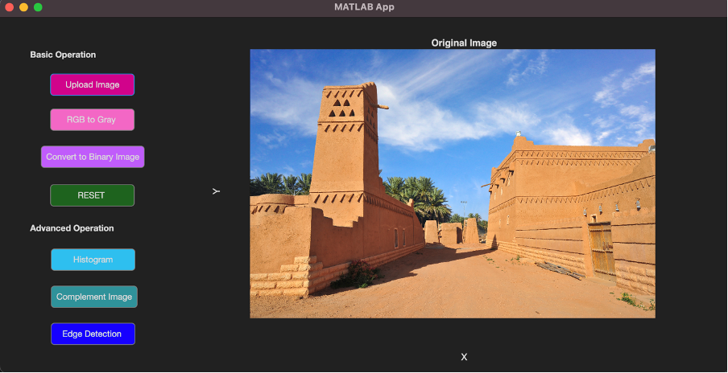
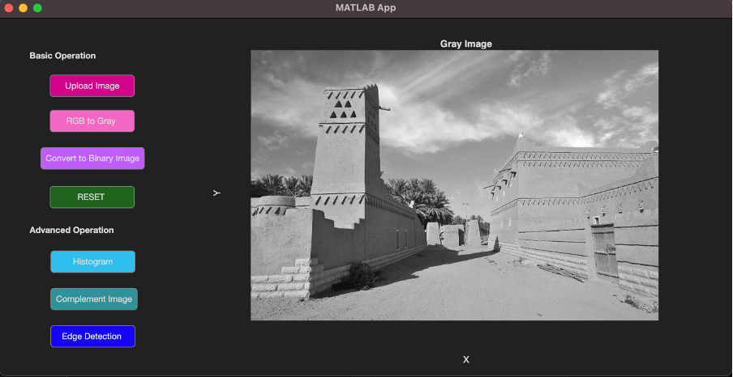
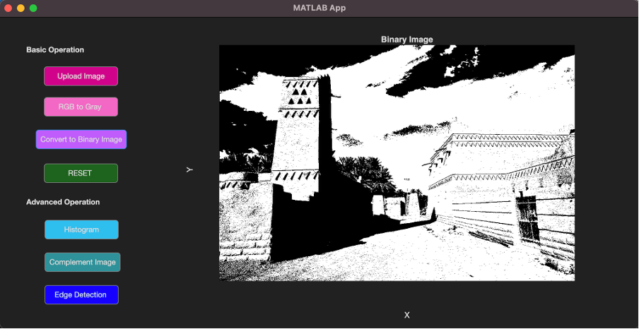
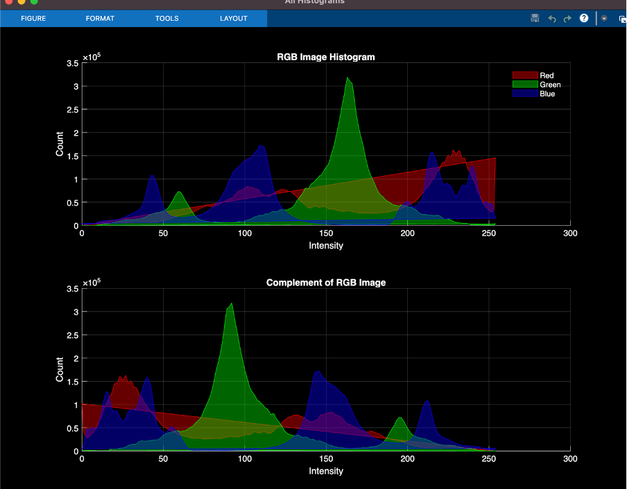
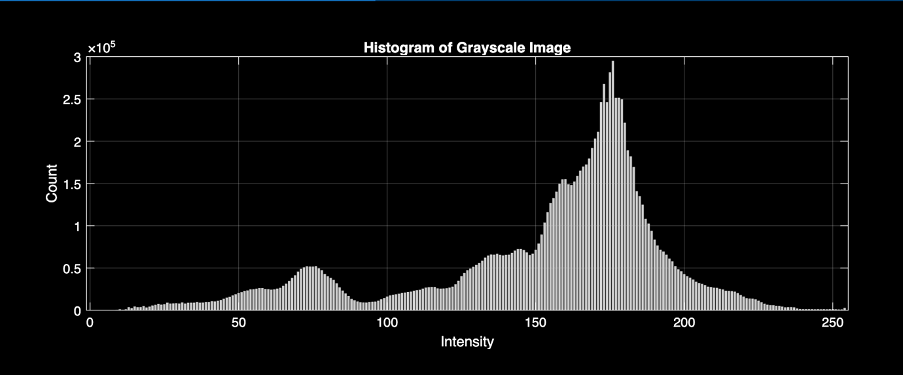
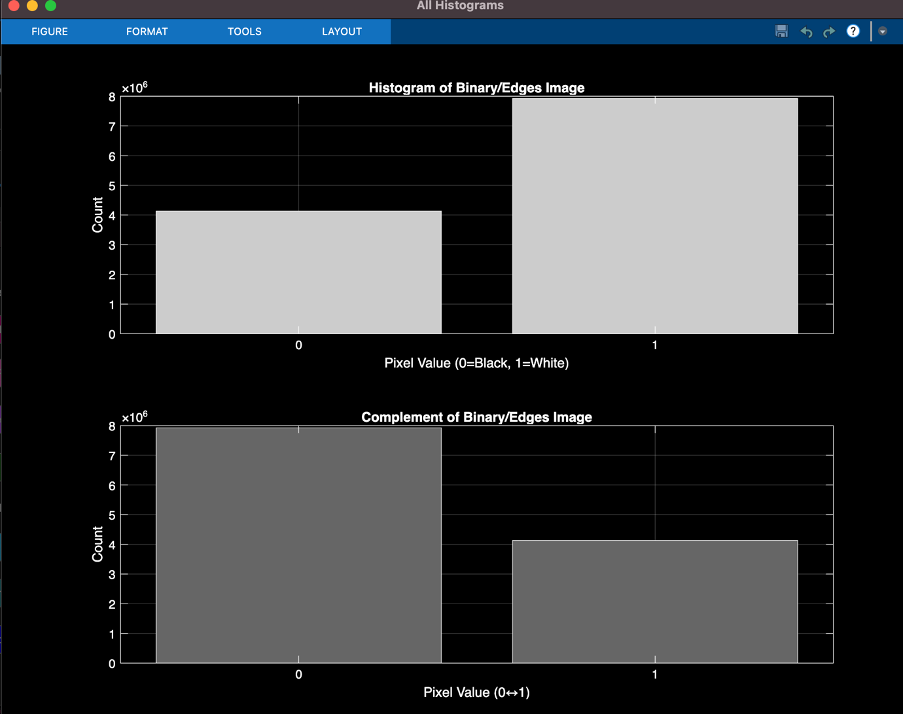
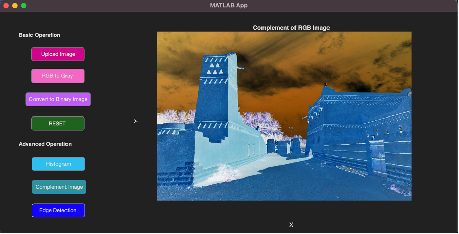
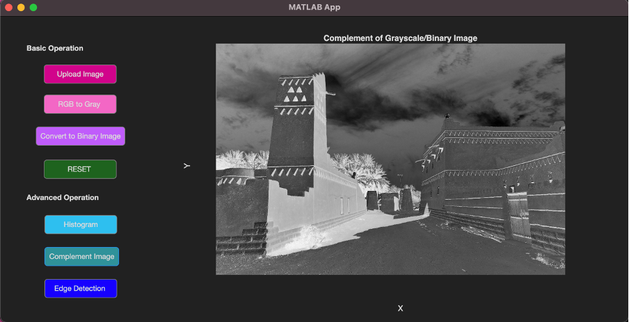
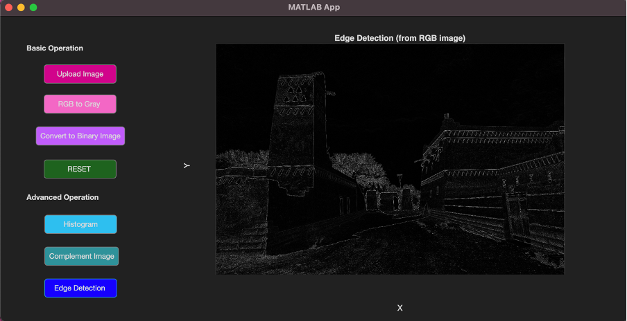
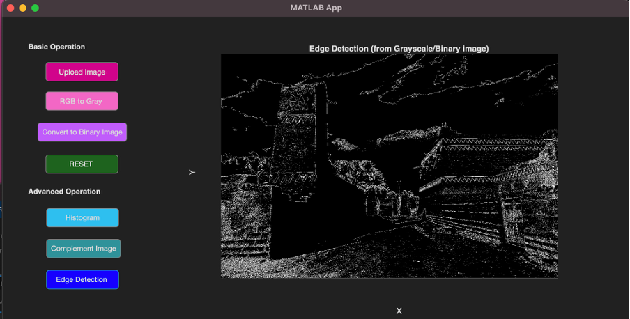

# MATLAB Image Processing App  
This project demonstrates various image‑processing operations using MATLAB App Designer.  
All output images are stored inside the **images_bundle/** directory.

---

## 📌 1. Original Image  
This is the uploaded RGB image.

---

## 🎨 2. Grayscale Conversion  
Converted using `rgb2gray()` to remove color and keep intensity values.

---

## ⚫⚪ 3. Binary Image  
Generated using MATLAB `imbinarize()`, converting the grayscale image to pure black/white.

---

## 📊 4. RGB Histogram  
Shows the distribution of pixel intensities for Red, Green, and Blue channels.

---

## 📊 5. Grayscale Histogram  
Displays the intensity distribution of the grayscale image.

---

## 📊 6. Binary / Edge Histogram  
Shows pixel counts for values 0 (black) and 1 (white) in binary or edge-detected images.

---

## 🔁 7. Complement of RGB Image  
Produces the negative version of the RGB image.

---

## 🔁 8. Complement of Grayscale/Binary Image  
Inverts pixel intensities:  
- Black ↔ White  
- Low ↔ High intensity

---

## ✨ 9. Edge Detection (RGB)  
Extracts edges directly from the RGB image.

---

## ✨ 10. Edge Detection (Grayscale/Binary)  
Edges extracted after grayscale or binary conversion, usually giving cleaner results.

---

## ✅ Summary  
This app supports:  
- Image upload  
- RGB → Grayscale  
- Conversion to binary  
- Histogram visualization  
- Complement image  
- Edge detection  

All outputs are displayed inside the app and saved in **images_bundle/**.

